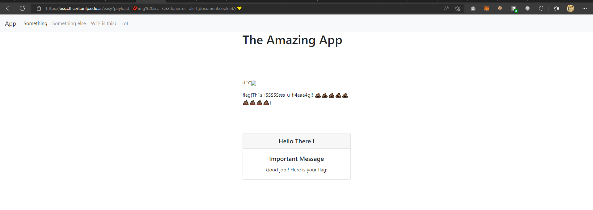

# 💩XSS💩
## Flag Format
flag{xxxxx}
## Hint
`htmlspecialchars`
## Solution
Challenge : https://xss.ctf.cert.unlp.edu.ar/

I entered this website and found input box that i have to input something
for make `alert(document.cookie)` .
I tried to use intruder with payload all the things.
So None of them are usable.
However,I read the hint and found that I had to find a way to bypass it.
Until I found something interesting => [How I found an XSS vulnerability via using emojis](https://medium.com/@fpatrik/how-i-found-an-xss-vulnerability-via-using-emojis-7ad72de49209)

Payload
```
💋img src=x onerror=alert(document.cookie)//💛
```

GOTCHA.
Finaly, I got the flag.



