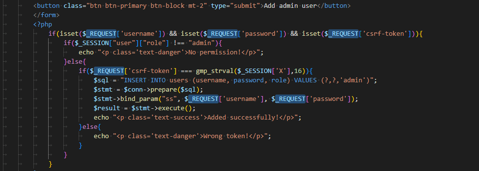
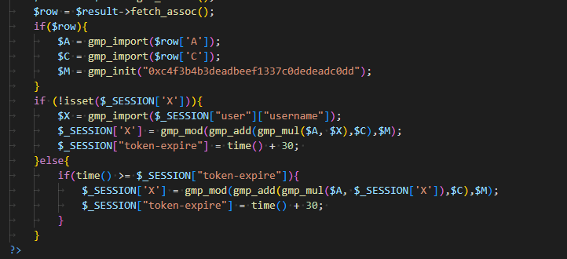
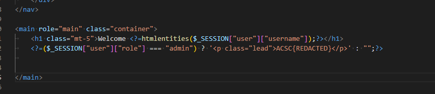
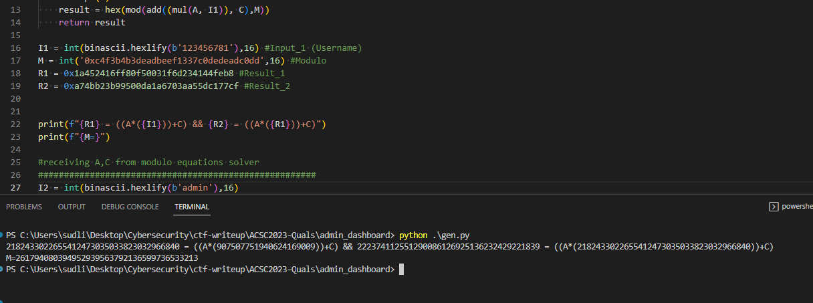
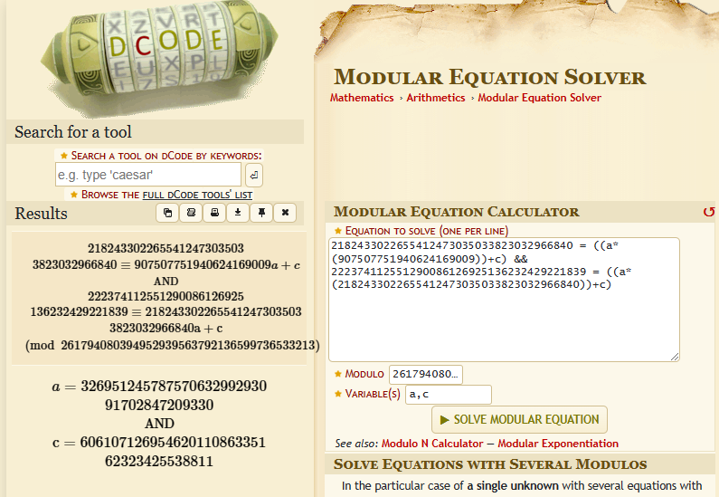
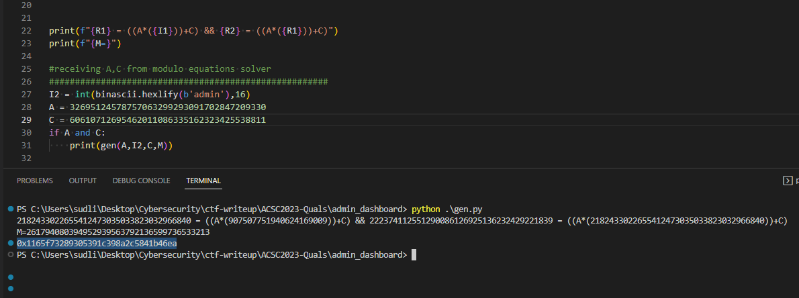
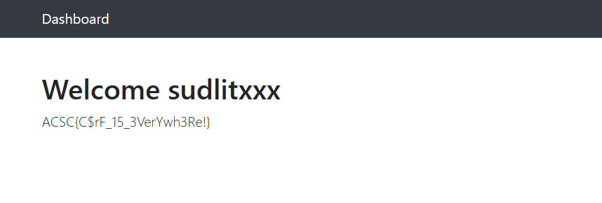

### 🏁 About Challenge

Challenge : [Link](http://admin-dashboard.chal.ctf.acsc.asia/)

Description : `I built my first website, admin dashboard with bootstrap and PHP! Feel free to try it! Hope there is no bug..`

Flag Format : *ACSA{...}*

All of this was helped by  *Lucas Tan* 

### Getting Started

this website has login page,register page ,report url to admin page and secret page which is **addadmin** page. So It is hidden in menu bar.
I start from read and analyze **index.php** **addadmin.php** and **report.php**





So flag will show at index page when roles from session is `"admin"`

Obviously in *addadmin page*, I found **$_REQUEST** that can recieve data from both of GET and POST method so we can send *username, password, csrf-token* to server side.


Here are the steps to do:
- Obtaining two csrf-token and calculating A,C from Modulo Equations Solving 
- Generating csrf-token with `"admin"` signer
- Send URL with parameter to report page for admin open this
- Login with new user that admin created and get the flag

After I have gotten two CSRF-token,I will get two equations too.
```
csrf-token=0x1a452416ff80f50031f6d234144feb8=gmp_mod(gmp_add(gmp_mul($A, gmp_import("123456781")),$C),gmp_init("0xc4f3b4b3deadbeef1337c0dedeadc0dd"))

csrf-token=0xa74bb23b99500da1a6703aa55dc177cf=gmp_mod(gmp_add(gmp_mul($A, 0x2482d495da6cd9022e88409822651761),$C),gmp_init("0xc4f3b4b3deadbeef1337c0dedeadc0dd"))
```


I wrote python script for creating equations for Solving
by Modular Equation Solver from dcode.fr.It also can generating admin csrf-token.

This is output when I put R1,R2,I1,M to python script.
```
221659799348956823143700040298845790249 = ((A*(134666459445882))+C) && 73409535447087527716395983774812103739 = ((A*(221659799348956823143700040298845790249))+C)

M=261794080394952939563792136599736533213
```
So I recieved A and C. After this we will generate the admin's CSRF-token by using the one python sript.




Summit URL Report for admin entering and adding new a admin user.
```
http://localhost/addadmin?username=sudlitxxx&password=sudlitxxx&csrf-token=1165f73289305391c398a2c5841b46ea
```

Log out and back in with your new account to receive the flag. 
 

###

#### Hope you enjoy this 

#### I couldn't do this in time. =w=*


