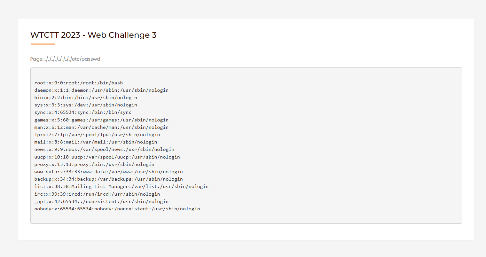
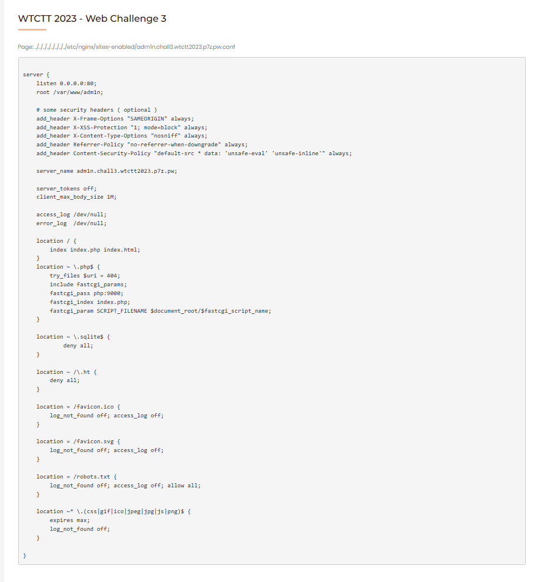
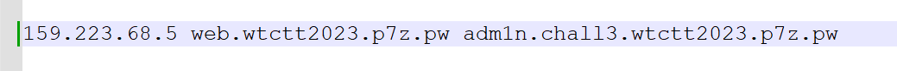
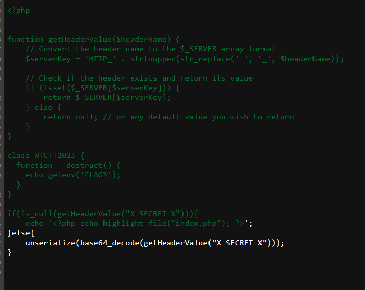
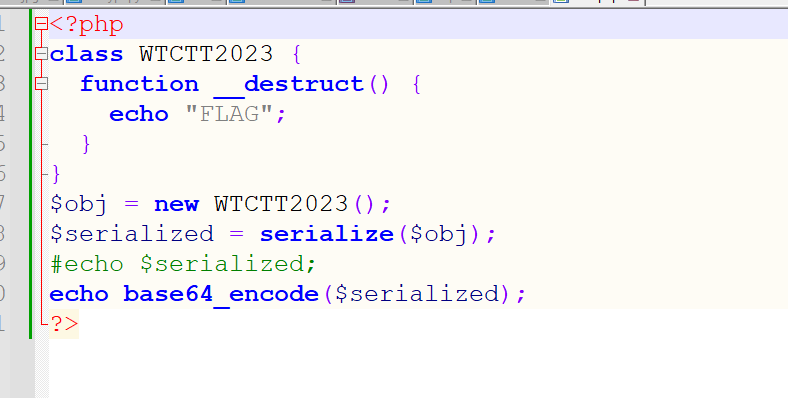
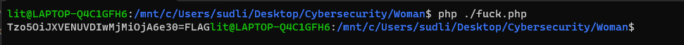
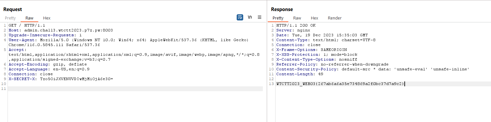

# Web 3 - Path Traversal over vHost

## Description

> Read one file and it will lead you to new clues. The challenge consists of 2 vHost, but you do not need to perform vHost Fuzzing (please avoid doing it).
> 
> 
> Flag Format: WTCTT2023_WEB03{[a-z0-9]{32}}
> 
> URL: [http://web.wtctt2023.p7z.pw:8003/](http://web.wtctt2023.p7z.pw:8003/)
> 
> Hidden vHost URL Pattern: https://?????.chall3.wtctt2023.p7z.pw
> 
> Hint 1: Directory Fuzzing is NOT required (no hidden files / web pages).
> 
> Hint 2: Online password brute forcing (dictionary attack) is NOT required.
> 
> Hint 3: The challenge is designed to be exploited manually without automated security scanners.
> 

## Solution

From the challenge name it's easy to guess that this challenge doing about path traversal
and I found vulnerability at `?page=` parameter which is LFI vuln so i tried to input too many file name. And I went back and read the description again which have mentioned to vHost.

```
http://web.wtctt2023.p7z.pw:8003/index.php?page=../../../../../../../../etc/passwd
```



### We have important information as follows:

- This vulnerability only allows access to /etc/,/var/www,/tmp
- There is a hidden vhost

After a few minutes of searching I found  `/etc/nginx/conf.d/default.conf` is used to configure the default virtual host. So I input to page param for read this file


From content of this file we can see vhost config file that be commented in 3rd line.
and I input to page param for read that file again.



Although we already know secret vhost, we can't access to `adm1n.chall3.wtctt2023.p7z.pw` directly. We have to add this domain to hosts file for access the website at port 8003



After editing hosts file, I go input to read source code of index.php for this domain.

```
http://web.wtctt2023.p7z.pw:8003/index.php?page=../../../../../../../../var/www/adm1n/index.php
```



So we found the unserialize function that confirms that there is an insecure deserialization vulnerability by without sanitizing filter. And we can input payload at `X-SECRET-X` header.
I decided to create php script for generating payload for calling the magic fucntion.





let's enter payload to `X-SECRET-X` header for getting the flag.

